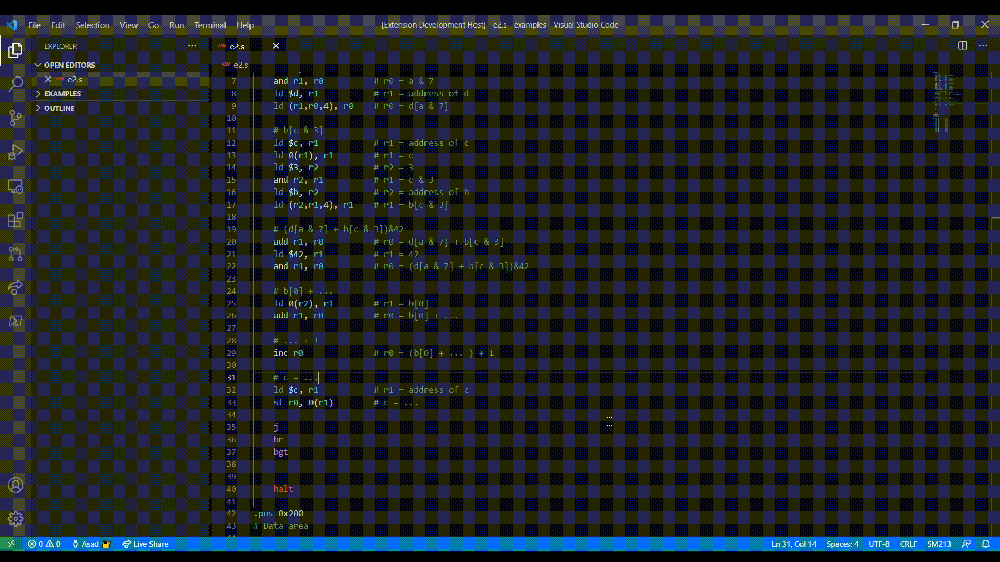

# SM213 Support

> This project is being developed for the SM213 language used in CPSC 213, UBC

This extension provides VS Code with the required grammar rules to appropraitely break your sm213 code into tokens. These tokens are used by VS Code to style your sm213 code accordingly. What does that mean? It means that regardless of the theme you use, VS Code will be able to know what colors to use where using the defined grammar.

## Installing

The extension will eventually be published on the VS Code marketplace, before the end of the term. Until then you can copy it into the `<user home>/.vscode/extensions` folder and restart VS Code.

 When you open a `.s` file, VS Code should automatically detect and select the extension unless you have another extension installed for assembly files.

## Known Issues

- Grammar rules need to be revised and further tested
- Missing sm213 syntax not covered in class yet